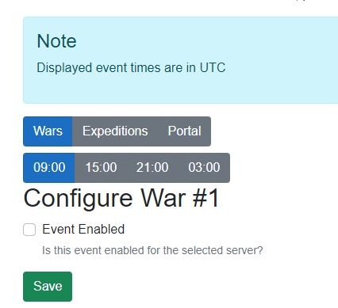

## Major Changes

### Expeditions [#72](https://github.com/XtremeOwnage/WarBot/issues/72)

WarBOT Now has support for expeditions!

These are configured exactly like Hustle Castle Wars. In a future update, it is planned to introduce configurable times.

For the time being, timing will remain the same as wars.

1. Discord Event will be created 4 hours before the start of the expedition, if enabled.
2. Prep Starting will be sent 2 hours before the start of the expedition, if enabled.
3. Prep Ending will be sent 15 minutes before the start of the expedition, if enabled.
4. Event Started will be sent when the expedition starts, if enabled.
5. Discord event will end 15 minutes after the expedition starts, if enabled.

Commands are exactly the same as those used for Wars, except, prefixed with /expedition instead of /war.

### Configuration Site - Hustle Events

The hustle event section of the configuration site has been simplified to prevent the screen from overflowing on mobile devices.

Upon selecting "War" or "Expedition", you will then have a submenu to select the specific event you want to manage. CURRENTLY, event times are specified in UTC.

In the future [#58](https://github.com/XtremeOwnage/WarBot/issues/58) will convert these to your guild's localized time.

### WarBOT Prod

Has been updated to Version [4.1.1](./v4.1.1.md)

## Minor changes

(Most of these, are not things you will notice as a user.)

### Time Helper

To manage all of the various event times for hustle castle, I updated my "time helper" to be much easier to leverage.

As well, all of the schedules have been abstracted, which greatly reduces the amount of code and logic needed.

### Certain enum values changed.

When setting wars, exeditions, etc... instead of setting WAR_1, EXPEDITION_1, etc.... the value is named EVENT_1, EVENT_2, etc.

This allows me to simplify the codebase a bit, and not maintain multiple enums for each different type of event we may manage.

### Extended Scripted Migrations

Upon adding the additional relationships, it was noticed the current migrations system could not handle automatically populating the required relationships.

As so, a simple startup check was added to WarBOT which will automatically upgrade the schema version of all attached guilds.