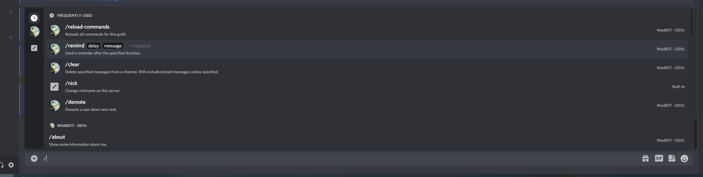

By default, after you invite warbot, you should be able to instantly see the common commands in the chat, by simpally typing `/`

If you cannot see any commands in your server, this may be due to a few reasons.

1. WarBOT was added with incorrect permissions.
    * The easiest way to resolve this, is by kicking WarBOT, and adding him back through the link on the [Warbot configuration site](https://warbot.dev/)
    * If you are purposly restricting WarBOT's permissions, it is recommended you read [Which Permissions Are Required](./Permissions.md)

2. I (as the developer) broke it. This happens commonly with Warbot-dev. However, this should not be an issue with Warbot, once v4.0 goes live.

In most cases, the easiest method to resolve this issue is by removing the bot, and readding it. It will not lose any configuration when you do so. 