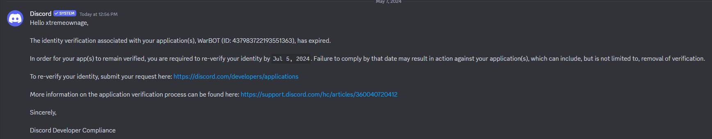
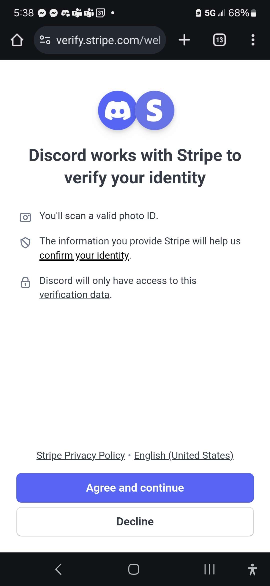
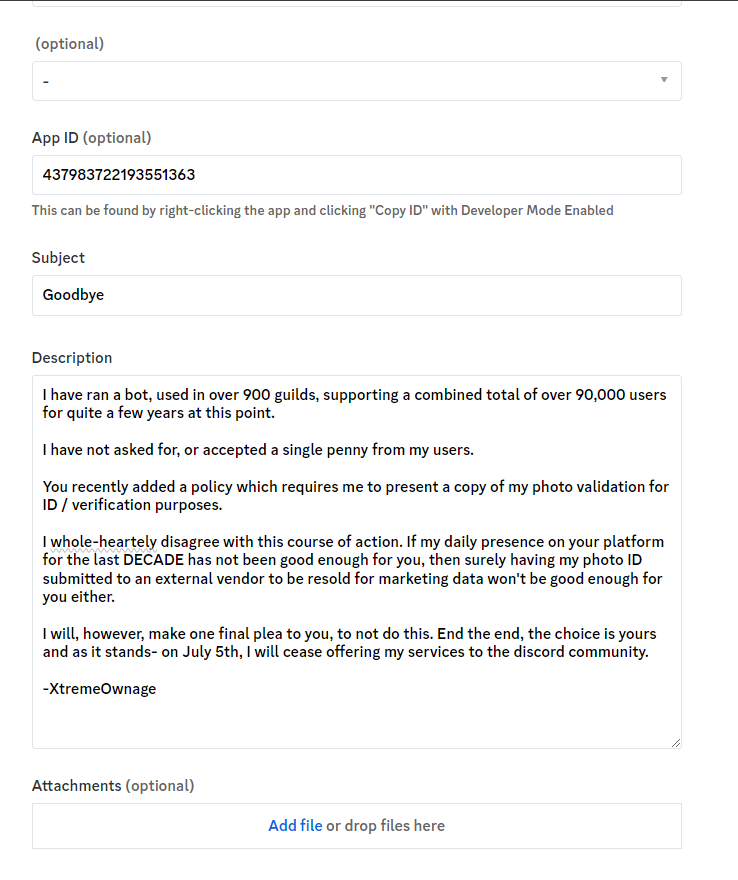

Warbot is a discord bot orignally designed for the hustle-castle mobile phone game. It is intended to display a notification when wars are starting, to assist with reminding members to deploy their troops.

These days, Warbot is a general purpose discord bot, offering many useful features to your discord guild.

## Importance Notice - May 2024

!!! danger
    If action is not taken by July 5th, 2024, WarBOT will cease to offer their services to the discord community.

    It has been a great 8 years.

On May 7th, I received this notice from discord.



I figure, oh, just need to go re-verify my account. Shouldn't be an issue, right?



Turns out- they want me to upload a copy of my photo ID.

For MANY reasons, including- but, not limited to...

* Privacy
* Data theft concerns
* The use of my data for marketing
* etc...

I refuse to upload a copy of my photo ID. I have been a consistent user of discord, for over a decade at this point. 

If- my history is not enough of a verification, then I am sure an easily faked photo ID will not suffice either. 

That being said- I will not be playing these games.

I did, however, submit a ticket to discord.



I seriously doubt it will be read, or taken seriously... but, I did submit it.


That being said- WarBOT at its peak has supported over 1,500 unique guilds. At this time of writing this- 859 guilds are still subscribed to WarBOT with a combined total of 94,761 users.

I have never asked for, or accepted a single penny from the community which I support.

I have never once, displayed any forms of advertisement, or asked for any form of compensation. 

I have not once, lost, or had any user-data stolen.

I have never sold, or used user-data for marketing purposes.

As a matter of fact, I don't even collect user-data, other then the settings you specify for your guilds.


It has been fantastic supporting all of you. Good luck in the future.

-XtremeOwnage


!!! info
    If- anyone DID want to give discord a copy of their drivers license, or photo ID, WarBOT is open source, and can be easily hosted.


## Basic Features

#### Custom Commands

Get tired of managing users? Ever wish users could add themselves to a discord role? Well. Now they can.

Warbot gives you the ability to create custom commands. These commands can perform actions such as...

* Replying to the user with a message of your choice.
* Sending a message in an unrelated channel.
* Adding the user to a discord role.
* Removing the user from a discord role.

Each custom command can contain many actions. So, it is possible to....

1. Add the user to a role
2. Send a message in a channel which requires the above role, tagging the user to say, Hey, @User, look here!
3. Reply to the user and say a message of your choosing.

Please read more in the documentation for [Custom Commands](Features/CustomCommands.md)

#### Discord Role Management

Warbot can easily handle promoting or demoting members to roles. Easy to use, just type `/promote` or `/demote`

Learn more about role managment [Here](Features/RoleManagement.md)

<!--
### Voting

Ever need a standarized way to initiate a vote in Discord? WarBOT is here to help!

```
bot, vote 5m Question goes here
```

* The duration of the poll is adjustable from 5 minutes, up to 1 day.
* You have configurable options.
* The entire poll entry process is guided.
-->

#### Reminders
Need to be reminded of something in the future? Simple. Type `/remind delay:5m message:Its been 5 minutes` WarBOT will send your message after the desired delay.

Learn more about remindars [Here](Features/Reminders.md)

#### Cleaning up old messages
Wish to keep your channels all nice and clean? Hate manually removing messages?

Type `/clear`. Warbot will clear all messages up to 10 days. 

To learn about more options, look at the [Clear Documentation](Features/ClearMessages.md)

#### New user greetings, and farewell messages
WarBOT can greet new users, and/or send a farewell when users leave.

Please read about these features [Here](Features/UserJoinLeave.md)


## Game Specific Features

### Hustle Castle

#### War Notifications

Ever get tired of manually reminding people to deploy their troops for clan wars? Well, Warbot can do this for you.

You can optionally send these events, for each of the wars, automatically.

* Discord Event for War Prep - Creates a discord event for the upcoming war. Sent out two hours before the preperation begins to give time for users to opt-in.
* War Preperation Started Message - Sends a message of your choosing to the channel configured for this specific war.
* War Preperation Ending Message - 15 minutes before the war starts, you can optionally send a secondary remindar to deploy.
* War Started Message - Delivers a message for when the war has started.

Each of the above events is optional, and may be opted out. 

As well, each war is optional, and can be configured to a different channel, if desired. Each war has its own messages

Read more in the [Hustle Castle Documentation](Features/HustleFeatures.md#Wars)

#### Portal Notifications

Have trouble remember when the portal opens every week? Warbot can remind you in the channel you desire, with a message you can set.

Read more in the [Hustle Castle Documentation](Features/HustleFeatures.md#Portal)


# How to add WarBOT?
To Invite WarBot to your discord server, Please visit the [WarBot Site](https://warbot.dev/)

In the Select a guild screen, click the "Invite WarBOT"  button at the bottom.

#### What are all of those permissions?? I don't like them!

Please read about.... [WarBOT Permissions](Faqs/Permissions.md)

# Faqs

#### The bot is replying, but, is I cannot see any text.

* You must have link previews enabled. Discord does not distinguish between embeds (a formatted way to display information), and actual link previews.

#### The bot is collecting and selling my information

* Not at all. I have better things to do then to collect your discord transcripts! Feel free to look through the source code.

# Other

You may join the [WarBot Development discord server](https://discord.gg/uEkamH9) for support.

If you would like a new feature, [Send a request!](https://github.com/XtremeOwnage/WarBot/issues/new/choose)
